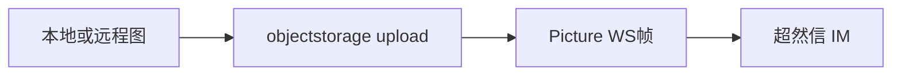

# 超然信出站图片规范（Hermes 插件）

**状态：** 现行  
**受众：** 插件维护者、二次分发者、对接超然信 IM 的开发者  
**权威协议：** 上游 [`ROBOT_THIRD_PARTY.md`](file:///Users/mac/Desktop/XsignServer/im/docs/ROBOT_THIRD_PARTY.md) §6.2 / §6.3（Picture 与 objectstorage 上传）  
**实现位置：** [`chaoranxin/`](../chaoranxin/)（`media.py` + `adapter.py`）  
**最后更新：** 2026-07-23

---

## 1. 设计原则（硬性）

### 1.1 与文字同一通道

出站图片与出站文字在 Hermes↔超然信链路上是**同一种投递**：WebSocket `/robot` 上的明文 JSON 帧。

| 内容 | 顶层 `type` / `data.clazz` | `content` |
|------|---------------------------|-----------|
| 文本（推荐） | `Markdown` | `{ "text": "..." }` |
| 图片 | `Picture` | `{ "smallurl", "originurl", "width?", "height?" }` |

图片帧里携带的是 **HTTPS URL**，不是二进制。二进制只出现在**文件服务上传**步骤。

### 1.2 插件自包含，禁止改 Hermes 核心

发图能力**必须**全部落在分发仓 `chaoranxin/` 内：

- 允许改：`media.py`、`adapter.py`、`proto.py`、`plugin.yaml`、`README.md`、本目录文档  
- **禁止**为发图去改：`tools/send_message_tool.py`、`gateway/platforms/base.py`、其它平台适配器等核心文件  

理由：目录插件要能单独拷贝到 `~/.hermes/plugins/chaoranxin/` 给第三方使用；核心硬编码平台名会破坏分发。

Gateway 会话回复发图走基类已有钩子 `send_image` / `send_image_file`（插件 override 即可），**不需要**在 `send_message_tool` 白名单里点名 `chaoranxin`。

---

## 2. 端到端流程

```text
本地文件或远程 http(s) URL
        │
        ▼
POST {file_base}/objectstorage/upload
  Authorization: Bearer rbt_*
  bizType=im
  accessLevel=PUBLIC
  file=<image bytes>
        │
        ▼  校验 code=0、accessLevel=PUBLIC、accessUrl 非空
data.accessUrl  (形如 https://d.xsign.co/oss/{uuid})
        │
        ▼
WS 发送:
{
  "type": "Picture",
  "data": {
    "uuid": "<idempotency-key>",
    "from": "<robot-uuid>",   // RobotLogin.data.robot
    "to":   "<user-uuid>",
    "clazz": "Picture",
    "role": "robot",
    "content": {
      "smallurl":  "<accessUrl>",
      "originurl": "<accessUrl>",  // 必须与 smallurl 相同
      "width":  "1080",            // 可选，字符串
      "height": "720"
    }
  }
}
```



---

## 3. 上传契约

| 项 | 规范值 |
|----|--------|
| 默认文件根 | `https://d.xsign.co` |
| 可覆盖 | `CHAORANXIN_FILE_BASE` 或 `platforms.chaoranxin.extra.file_base` |
| 路径 | `POST {file_base}/objectstorage/upload` |
| `bizType` | **必须** `im` |
| `accessLevel` | **必须** `PUBLIC` |
| 鉴权 | `Authorization: Bearer rbt_*`（与 WS 同一 token） |
| 成功条件 | `code == 0`，且 `data.accessUrl` 非空；`accessLevel` 若返回则须为 `PUBLIC` |
| 发帧 URL | `content.smallurl === content.originurl === accessUrl` |

实现模块：[`plugins/platforms/chaoranxin/media.py`](../../plugins/platforms/chaoranxin/media.py)

- `upload_public_image` / `upload_local_image`
- `build_picture_content`
- `is_file_service_oss_url`（已是本域 `/oss/{id}` 时可跳过二次上传）
- `probe_image_size`（PNG/JPEG/GIF/WebP 尽力解析；失败可省略宽高）

支持扩展名：`.jpg` `.jpeg` `.png` `.webp` `.gif`。

---

## 4. Adapter 行为规范

实现：[`ChaoranxinAdapter`](../../plugins/platforms/chaoranxin/adapter.py)

| 方法 | 行为 |
|------|------|
| `send_image_file(path)` | 校验路径 → 上传 → `_send_picture_frame` |
| `send_image(url)` | 若已是 `{file_base}/oss/...` → 直接发 Picture；否则 SSRF 安全下载后走 `send_image_file` |
| caption | Picture 协议无 caption 字段 → **另发一条 Markdown** |
| `_standalone_send` | 文本 Markdown + 图片 `media_files` 可连发；非图片附件返回明确错误（本版不做 Video/File/Voice） |

`from` 必须使用 `RobotLogin` 握手得到的 robot uuid（与发文字相同）。

---

## 5. Hermes 投递路径对照

| 场景 | 入口 | 是否依赖改核心 |
|------|------|----------------|
| Gateway 会话回复含图 / `MEDIA:` 本地图 | `base.py` → `send_image` / `send_image_file` | **否**（插件 override） |
| `send_message` 工具纯文本 `target=chaoranxin` | `_send_via_adapter` / standalone Markdown | **否** |
| `send_message` / cron 的 Hermes `MEDIA:` 附件白名单 | 核心按平台名白名单，未点名则省略附件 | **不为此改核心**；会话发图不受影响 |

分发插件时只拷贝插件目录即可，**不要**要求用户 patch `tools/send_message_tool.py`。

---

## 6. 目录插件分发清单

安装到 `~/.hermes/plugins/chaoranxin/` 至少包含：

| 文件 | 作用 |
|------|------|
| `plugin.yaml` | 清单（含可选 `CHAORANXIN_FILE_BASE`） |
| `__init__.py` | `register` |
| `adapter.py` | WS + `send_image*` |
| `proto.py` | 帧编解码 |
| `media.py` | 上传与 Picture content |
| `README.md` | 安装说明 |

---

## 7. 配置

| 变量 / 键 | 含义 | 默认 |
|-----------|------|------|
| `CHAORANXIN_BOT_TOKEN` | `rbt_*`，上传与 WS 共用 | （必填） |
| `CHAORANXIN_API_BASE` / `CHAORANXIN_HOST` | 节点发现或直连 WS | — |
| `CHAORANXIN_FILE_BASE` / `extra.file_base` | 对象存储根 | `https://d.xsign.co` |

---

## 8. 自检清单

- [ ] 上传使用 `bizType=im` + `accessLevel=PUBLIC` + `Bearer rbt_*`
- [ ] `smallurl` 与 `originurl` 同为 `accessUrl`
- [ ] 顶层 `type` 与 `data.clazz` 均为 `Picture`
- [ ] `from` 为 `RobotLogin.data.robot`
- [ ] 发图逻辑仅在插件目录，未改 Hermes 核心
- [ ] 分发包含 `media.py`

---

## 9. 相关文档

- 插件说明：[`chaoranxin/README.md`](../chaoranxin/README.md)
- 上游第三方机器人指南：`ROBOT_THIRD_PARTY.md` §3.5 / §6.2 / §6.3

## 10. 同步到独立插件仓库

见总规范 **[`plugin-sync.md`](./plugin-sync.md)**（每次改开发树插件后必须同步并 commit 本仓）。
